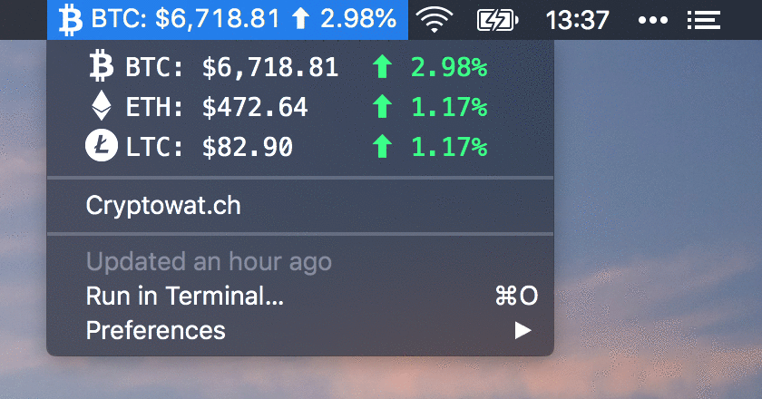

<h3 align="center">Cryptowatch Ticker</h3>

📈 Configurable cryptowat.ch price tracking ticker plugin for BitBar

## Installation

See official BitBar instructions for [installing plugins](https://github.com/matryer/bitbar#installing-plugins).

## Features

- Configurable:
    - Exchange
    - Currency
    - Show Icons
    - Show Currency Codes
    - Custom Arrow Icons
    - Enabled Currencies
        - BTC
        - LTC
        - ETH
- Ticker flicks between enabled cryptocurrencies
- Dropdown displays current exchange rates and 24h percentage changes for enabled cryptocurrencies
- Click currencies to view candlestick charts on [Cryptowat.ch](https://cryptowat.ch/)

## License

This project is licensed under the MIT License - see the [LICENSE.md](LICENSE.md) file for details.
