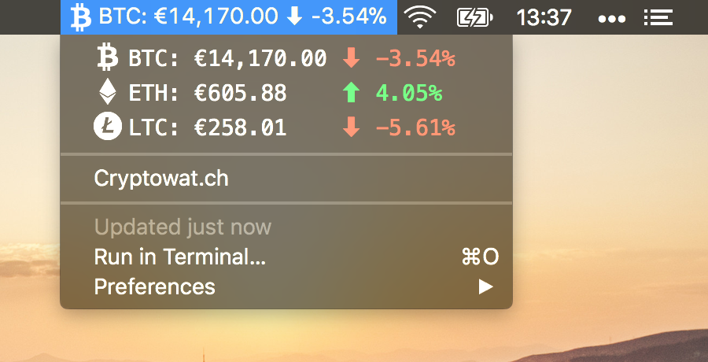

# BitBar Cryptowatch Ticker
> 📈 Configurable cryptowat.ch price tracking ticker plugin for BitBar

## 📦 Install

See official BitBar guide for [installing plugins](https://github.com/matryer/bitbar#installing-plugins).

## 🚀 Features

- Highly configurable
- Menu bar ticker switches between enabled cryptocurrencies
- Dropdown displays current exchange rates and 24h percentage changes for enabled cryptocurrencies
- Click currencies to view candlestick charts on [Cryptowat.ch](https://cryptowat.ch/)

## 📄 License

This project is licensed under the MIT License - see the [LICENSE.md](LICENSE.md) file for details.
